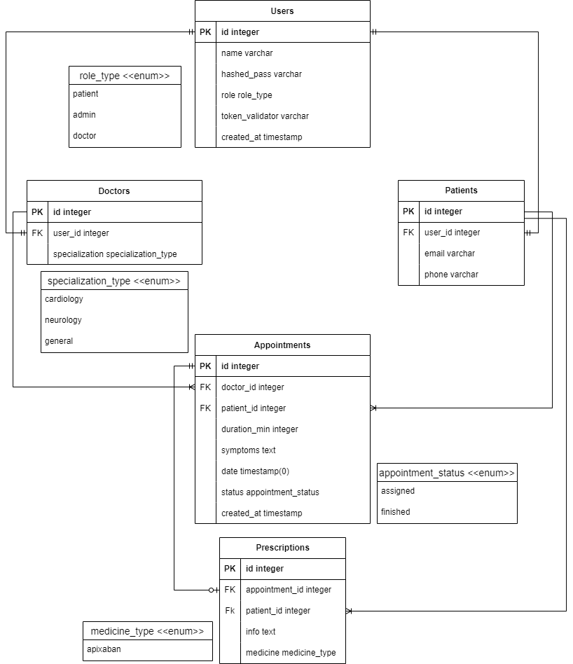

# Hospital Appointment Scheduler API documentation

# Content
- [Objective](#objective)
- [Features](#features)
- [API Reference Endpoints](#api-reference-endpoints)
    - [Common responses](#common-responses)
    - [User](#user)
    - [Specialization](#specialization)
    - [Doctor](#doctor)
    - [Patient](#patient)
    - [Appointment](#appointment)
    - [Prescription](#prescription)
    - [Auth](#auth)
- [Models](#models)
- [Errors](#errors)
- [Database](#database)
- [Tech Stack](#tech-stack)

# Objective
Create a hospital appointment scheduling system. Patients can enter their symptoms or required specialization (e.g., cardiology, surgery), and the system will find the nearest available appointment date with a doctor of the specified specialization. The system should consider doctor availability, patient load, and appointment duration.


# Features

- User management, by admin
- Appointment creation with specialization, by user
- Appointment creation with symptoms, by user
- Appointment management, by user
- Prescription creation, by doctor
- Login system

# API Reference Endpoints

## Endpoint Authorization
Every request header should include a JWT for Authorization.

See [Auth API](https://github.com/MelnikAndres/Solvd/blob/main/hospital_auth/README.md)

```
header:
    {
        ...
        Authorization: bearer <access_token>
        ...
    }
```


## Common responses
If any request that requires an id has an invalid or missing id, response will be:
```
    HTTP/1.1 404 Not Found
```

If any request that requires a body has invalid or missing data, response will be:
```
    HTTP/1.1 400 Bad Request
    Content-Type: application/json
    {ERROR_INVALID_FIELDS}
```
- see [ERROR_INVALID_FIELDS](#error-invalid-fields)

If any request has an expired or invalid token, respone will be:
```
    HTTP/1.1 403 Forbidden
    Content-Type: application/json
    {ERROR_INVALID_TOKEN}
```

- see [ERROR_INVALID_TOKEN](#error-invalid-token)


## User

### Get all users
Auth requirement: Admin level

```
  GET /users
```

- Query parameters

| Parameter | Type     | Description                |
| :-------- | :------- | :------------------------- |
| `role` | `string` | Optional. Role filtering|
| `name` | `string` | Optional. Name filtering|

- Response
    - Valid request
    ```
        HTTP/1.1 200 OK
        Content-Type: application/json 
        {
            "users": [
            {USER_MODEL},
            ]
        }
        
    ```
- Models
    
    see [USER_MODEL](#user-model)

### Get user
Auth requirement: Admin Level or Same User
```
  GET /users/${id}
```

- Query parameters


| Parameter | Type     | Description                       |
| :-------- | :------- | :-------------------------------- |
| `id`      | `integer` | **Required**. Id of user|

- Response:
    - Valid request
    ```
        HTTP/1.1 200 OK
        Content-Type: application/json
        {USER_MODEL}
    ```

- Models 

    see [USER_MODEL](#user-model)

### Update user
Auth requirement: Admin Level or Same User

```
  PUT /users/${id}
```

- Query parameters


| Parameter | Type     | Description                       |
| :-------- | :------- | :-------------------------------- |
| `id`      | `integer` | **Required**. Id of user|

- Body structure (JSON)

| Property | Type     | Description                       |
| :-------- | :------- | :-------------------------------- |
| `name` | `string` | **Optional**. username |
| `new_password` | `string` | **Optional**. new password|

- Response
    - Valid request
    ```
        HTTP/1.1 200 OK
        Content-Type: application/json
        {USER_MODEL}
    ```

- Models 

    see [USER_MODEL](#user-model)


### Delete user
Auth requirement: Admin Level

```
  DELETE /users/${id}
```

- Query parameters


| Parameter | Type     | Description                       |
| :-------- | :------- | :-------------------------------- |
| `id`      | `integer` | **Required**. Id of user|

- Response
    - Valid request
```
    HTTP/1.1 200 OK
```

### Create admin user
Auth requirement: Admin level
```
  POST /users/admin

```

- Body structure (JSON)

| Property | Type     | Description                       |
| :-------- | :------- | :-------------------------------- |
| `name` | `string` | **Required**. username|
| `password` | `string` | **Required**. password|
| `role` | `string` | **Required**. role (must be 'admin')|

- Response:
    - Valid request
    ```
        HTTP/1.1 200 OK
    ```


## Specialization

### Get all specializations
Auth requirement: User level

```
  GET /specializations
```

- Response
    - Valid request
    ```
        HTTP/1.1 200 OK
        Content-Type: application/json 
        {
            "users": [
            {SPECIALIZATION_MODEL},
            {SPECIALIZATION_MODEL}
            ]
        }
        
    ```
- Models
    
    see [SPECIALIZATION_MODEL](#specialization-model)

## Doctor

### Create doctor
Auth requirement: Admin level
```
  POST /doctors

```

- Body structure (JSON)

| Property | Type     | Description                       |
| :-------- | :------- | :-------------------------------- |
| `name` | `string` | **Required**. username|
| `password` | `string` | **Required**. password|
| `role` | `string` | **Required**. role|
| `specialization` | `string` | **Required**. doctor specialization|

- Response:
    - Valid request
    ```
        HTTP/1.1 200 OK
    ```

### Update doctor
Auth requirement: Admin Level or Same User

```
  PUT /doctors/${id}
```

- Query parameters


| Parameter | Type     | Description                       |
| :-------- | :------- | :-------------------------------- |
| `id`      | `integer` | **Required**. Id of user|

- Body structure (JSON)

| Property | Type     | Description                       |
| :-------- | :------- | :-------------------------------- |
| `specialization` | `string` | **Optional**. specialization |

- Response
    - Valid request
    ```
        HTTP/1.1 200 OK
    ```

### Get doctor
Auth requirement: Admin Level or Same User

```
  GET /doctors/${id}
```

- Query parameters


| Parameter | Type     | Description                       |
| :-------- | :------- | :-------------------------------- |
| `id`      | `integer` | **Required**. Id of user|


- Response
    - Valid request
    ```
        HTTP/1.1 200 OK
        Content-Type: application/json
        {DOCTOR_MODEL}
    ```

## Patient

### Create patient
Auth requirement: Admin level
```
  POST /patients

```

- Body structure (JSON)

| Property | Type     | Description                       |
| :-------- | :------- | :-------------------------------- |
| `name` | `string` | **Required**. username|
| `password` | `string` | **Required**. password|
| `role` | `string` | **Required**. role|
| `email` | `string` | **Optional**. patient email|
| `phone` | `string` | **Optional**. patient phone|

- Response:
    - Valid request
    ```
        HTTP/1.1 200 OK
    ```
### Update patient
Auth requirement: Admin level
```
  PUT /patients/${id}

```

- Query parameters


| Parameter | Type     | Description                       |
| :-------- | :------- | :-------------------------------- |
| `id`      | `integer` | **Required**. Id of user|

- Body structure (JSON)

| Property | Type     | Description                       |
| :-------- | :------- | :-------------------------------- |
| `email` | `string` | **Optional**. patient email|
| `phone` | `string` | **Optional**. patient phone|

- Response:
    - Valid request
    ```
        HTTP/1.1 200 OK
    ```

### Get patient
Auth requirement: Admin Level or Same User

```
  GET /patients/${id}
```

- Query parameters


| Parameter | Type     | Description                       |
| :-------- | :------- | :-------------------------------- |
| `id`      | `integer` | **Required**. Id of user|


- Response
    - Valid request
    ```
        HTTP/1.1 200 OK
        Content-Type: application/json
        {PATIENT_MODEL}
    ```

## Appointment

### Create appointment
Auth requirement: Admin level or same user
```
  POST /appointments

```
- Body structure (JSON)

| Property | Type     | Description                       |
| :-------- | :------- | :-------------------------------- |
| `patient_id` | `integer` | **Required**. id of patient|
| `specialization`      | `string` | **Optional**. specialization needed|
| `symptoms`      | `string` | **Optional**. patient symptoms|

- Response:
    - Valid request
    ```
        HTTP/1.1 200 OK
    ```

### Get appointments
Auth requirement: Admin level or same user

```
  GET /appointments
```

- Query parameters


| Parameter | Type     | Description                       |
| :-------- | :------- | :-------------------------------- |
| `id`      | `integer` | **Optional**. Id of appointment|
| `doctor_id`      | `integer` | **Optional**. Id of appointment|
| `patient_id` | `integer` | **Optional**. Id of patient|
| `status` | `string` | **Optional**. appointment status|
| `from` | `date` | **Optional**. only from this date on|
| `to` | `date` | **Optional**. only until this date|


- Response:
    - Valid request
    ```
        HTTP/1.1 200 OK
        Content-Type: application/json
        [
            {APPOINTMENT_MODEL},
            {APPOINTMENT_MODEL}
        ]
    ```

- Models 

    see [APPOINTMENT_MODEL](#appointment-model)

### Update appointment
Auth requirement: Admin level

```
  PUT /appointments/${id}
```

- Query parameters


| Parameter | Type     | Description                       |
| :-------- | :------- | :-------------------------------- |
| `id` | `integer` | **Required**. appointment id|


- Body structure (JSON)

| Property | Type     | Description                       |
| :-------- | :------- | :-------------------------------- |
| `status` | `string` | **Optional**. appointment status|

- Response:
    - Valid request
    ```
        HTTP/1.1 200 OK
    ```

### Delete appointment
Auth requirement: Admin level

```
  DELETE /appointments/${id}
```

- Query parameters


| Parameter | Type     | Description                       |
| :-------- | :------- | :-------------------------------- |
| `id` | `integer` | **Required**. appointment id|


- Response:
    - Valid request
    ```
        HTTP/1.1 200 OK
    ```

## Prescription

### Create prescription
Auth requirement: doctor
```
  POST /prescriptions

```

- Body structure (JSON)

| Property | Type     | Description                       |
| :-------- | :------- | :-------------------------------- |
| `appointment_id` | `integer` | **Optional**. appointment id|
| `patient_id` | `integer` | **Optional**. id of patient|
| `info` | `string` | **Optional**. info about prescription|
| `medicine` | `string` | **Optional**. medicine|

- Response:
    - Valid request
    ```
        HTTP/1.1 200 OK
    ```

### Get patient prescriptions
Auth requirement: Admin level or same user

```
  GET /prescriptions/${id}
```

- Query parameters


| Parameter | Type     | Description                       |
| :-------- | :------- | :-------------------------------- |
| `id`      | `integer` | **Required**. patient id|


- Response:
    - Valid request
    ```
        HTTP/1.1 200 OK
        Content-Type: application/json
        [
            {PRESCRIPTION_MODEL},
            {PRESCRIPTION_MODEL}
        ]
    ```

- Models 

    see [PRESCRIPTION_MODEL](#prescription-model)

### Update prescription
Auth requirement: Doctor level
```
  PUT /prescriptions/${id}

```

- Query parameters


| Parameter | Type     | Description                       |
| :-------- | :------- | :-------------------------------- |
| `id`      | `integer` | **Required**. Id of prescription|

- Body structure (JSON)

| Property | Type     | Description                       |
| :-------- | :------- | :-------------------------------- |
| `info` | `string` | **Optional**. info about prescription|
| `medicine` | `string` | **Optional**. medicine|

- Response:
    - Valid request
    ```
        HTTP/1.1 200 OK
    ```

### Delete prescription
Auth requirement: Doctor level
```
  PUT /prescriptions/${id}

```

- Query parameters


| Parameter | Type     | Description                       |
| :-------- | :------- | :-------------------------------- |
| `id`      | `integer` | **Required**. Id of prescription|

- Response:
    - Valid request
    ```
        HTTP/1.1 200 OK
    ```


## Auth

### Login
**Login will set cookie for jwt token authentication**
```
  POST /auth/login
```

- Body structure (JSON)

| Property | Type     | Description                       |
| :-------- | :------- | :-------------------------------- |
| `name` | `string` | **Required**. username|
| `password` | `string` | **Required**. password|

- Response:
    - Valid request
    ```
        HTTP/1.1 200 OK
    ```

### Logout
**Logout will remove jwt token from client**
```
  POST /auth/logout
```
- Response:
    - Valid request
    ```
        HTTP/1.1 200 OK
    ```

# Models 
These models are not the same as DB models, those have more data that is not shared.
#### User model 
User model may be replaced by another role model if appropriate.
Contact options are different for each user, this is just an example.
```
USER_MODEL
{
    "id": 1,
    "name":"John Doe",
    "role":"patient"
}
 ```

#### Specialization model 

```
SPECIALIZATION_MODEL
{
    "id": 1,
    "name":"Traumatology",
}
 ```

#### Doctor model 
Doctor model contains the same as user model, but also has specialization
```
DOCTOR_MODEL
{
    ...
    "specialization":"Traumatology"
    ...
}
 ```
#### Patient model 
Patient model contains the same as user model, but also has email and phone
```
PATIENT_MODEL
{
    ...
    "email":"something@example.com",
    "phone":"123456789"
    ...
}
 ```

#### Appointment model 

```
APPOINTMENT_MODEL
{
    "id": 1,
    "doctor_id":2,
    "patient_id":3,
    "duration_min":60,
    "date":"2023-10-06 19:00:00" ,
    "status":"assigned",
    "symptoms":"headache"
    "created_at":"2023-10-06 17:00:00" 
}
 ```

#### Prescription model 

```
PRESCRIPTION_MODEL
{
    "id": 1,
    "appointment_id":2,
    "patient_id":3,
    "info":"1 every 12 hs",
    "medicine":"apixaban"
}
 ```
 
# Errors

#### Error invalid fields
Contains information about the fields that are causing a problem.

```
ERROR_INVALID_FIELDS
{   "errors": [
    "x must be string",
    "x is required"
]
}
```

#### Error invalid token
Contains information about the problem encountered with the token.

```
ERROR_INVALID_TOKEN
{   "errors": "INVALID_TOKEN",
    "cause":"expired" || "forbidden" || "invalid"
}
```


## Database



## Tech Stack

**Server:** Node, Express

**Database:** PostgreSQL

**Deployment:** Docker